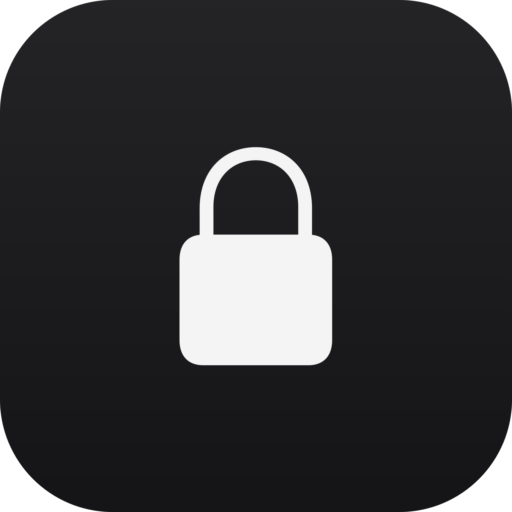

<div align="center">
  
  <h1>TapLock</h1>
  <p>Temporarily disable keyboard and trackpad input, or take relaxing breaks on your Mac.<br><strong>No root required</strong></p>
  <br>
  <a href="https://github.com/ugurcandede/taplock/releases/latest"></a>
  <a href="https://github.com/ugurcandede/taplock/actions/workflows/build.yml"></a>
  <br>
  
  
  <a href="LICENSE"></a>
</div>

---
#### Releated
<p style="text-align: center">
  <a href="https://ugurcandede.github.io/taplock-app"></a>
  <a href="https://github.com/ugurcandede/taplock-app"></a>
  <a href="https://github.com/ugurcandede/homebrew-taplock"></a>
</p>

---

## Install

```bash
brew tap ugurcandede/taplock
brew install taplock                # CLI
brew install --cask taplock-app     # Menu bar app
```

### Build from source

```bash
git clone https://github.com/ugurcandede/taplock.git
cd taplock
swift build -c release
# Binary at .build/release/taplock
```

---

## Features

| | Feature | Description |
|---|---|---|
| ⌨️ | **Input Blocking** | Block keyboard, trackpad, and mouse via CGEvent tap |
| ⏱️ | **Countdown Overlay** | Full-screen timer with clock display, customizable color |
| ♾️ | **Flexible Duration** | Seconds, minutes, hours, or indefinite with 5 min safety auto-unlock |
| 🔅 | **Screen Dimming** | Reduce brightness to minimum during lock, restores on exit |
| 🔔 | **Sound Feedback** | Audio cues on lock start/end. Silent mode available |
| 🚨 | **Emergency Cancel** | Hold **⌘⌥⌃L** for 3 seconds to cancel — always works |
| 🧘 | **Relaxing Sessions** | Periodic break reminders with calming overlay themes |

---

## Usage

### Lock Mode

```bash
taplock                          # Lock until cancelled (5 min safety)
taplock 30                       # Lock for 30 seconds
taplock 2m                       # Lock for 2 minutes
taplock 1h30m                    # Lock for 1 hour 30 minutes
```

### Relax Mode

```bash
taplock relax --every 25m --break 5m          # Pomodoro-style breaks
taplock relax --every 1h --break 10m          # Hourly 10-min breaks
taplock relax --every 45m --break 5m --theme minimal --color blue
taplock relax                                  # Start with saved config
taplock relax --config                         # Show saved config
taplock relax --cancel                         # Stop relaxing session
```

### Lock Options

| Option | Description |
|---|---|
| `--cancel` | Cancel an active lock session |
| `--keyboard-only` | Block keyboard only, not trackpad |
| `--no-overlay` | Skip the full-screen overlay UI |
| `--delay <seconds>` | Wait before activating lock |
| `--color <value>` | Overlay color: name (`black`, `red`...) or hex (`fff`, `#FF0000`) |
| `--dim` | Reduce screen brightness to minimum |
| `--silent` | Disable sound effects |

### Relax Options

| Option | Description |
|---|---|
| `--every <duration>` | Interval between breaks (e.g. `25m`, `1h`, `1h30m`) |
| `--break <duration>` | Break duration (e.g. `5m`, `10m`, `30s`) |
| `--theme <name>` | Visual theme: `breathing` (default), `minimal`, `mini` |
| `--color <value>` | Overlay color (default: `green`) |
| `--opacity <0.1-1.0>` | Overlay opacity (default: `0.85`) |
| `--silent` | Disable all sounds including pre-notification |
| `--cancel` | Cancel active relaxing session |
| `--config` | Show saved configuration |
| `--reset` | Delete saved configuration |

Configuration is auto-saved when `--every` and `--break` are provided.

### Emergency Cancel

Press **⌘⌥⌃L** (Cmd + Option + Ctrl + L) and hold for **3 seconds** to cancel at any time.

---

## Relax Themes

| Theme | Description |
|---|---|
| `breathing` | Full-screen dark overlay with a softly pulsing circle |
| `minimal` | Centered glass card with blur effect, no full-screen background |
| `mini` | Small floating bar at the top of the screen — non-intrusive |

---

## How it works

- **CGEvent tap** at session level blocks keyboard, trackpad, mouse, and gesture events
- **PID file** at `~/Library/Caches/taplock/` enables cross-terminal cancel via `--cancel`
- **DispatchSource** signal handlers ensure input and brightness are always restored on exit
- **Relaxing sessions** use a repeating timer with configurable interval/break duration and visual overlay themes

---

## Known Limitations

Some system-level keyboard shortcuts **cannot be blocked** by any CGEvent tap. This is a macOS security restriction, not a bug. These include:

- **⌘ Tab** (App Switcher)
- **⌘ Space** (Spotlight)
- **⌃ ←/→** (Switch Desktop)
- **Media keys** (volume, brightness, play/pause)
- **Power button / Touch ID**

## Requirements

macOS 13.0 (Ventura) or later · Apple Silicon or Intel · Accessibility permission

## License

Source Available — free to use, not to modify or redistribute. See [LICENSE](LICENSE).
